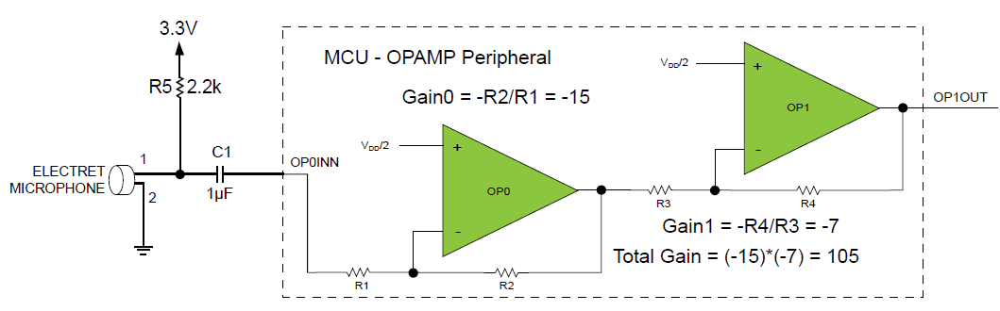

# Low-BOM Microphone Clap Sensor Using the OPAMPs inside the AVR DB 

Forked from https://github.com/microchip-pic-avr-examples/avr128db48-low-bom-mic-interface-using-opamp

Added ADC measurements to detect peaks, in addition to timing, to use it as an advanced clap detector

  

## Related Documentation

* [AN3631 - Low-BOM Microphone Interface Using the Analog Signal Conditioning (OPAMP) Peripheral](https://microchip.com/DS00003631)
* [AVR128DB48 Curiosity Nano User Guide](https://www.microchip.com/DS50003037)
* [AVR128DB48 Device Page](https://www.microchip.com/wwwproducts/en/AVR128DB48)

## Software Used
* Microchip Studio

## Hardware Used

* [AVR128DB48 Curiosity Nano](https://www.microchip.com/DevelopmentTools/ProductDetails/PartNO/EV35L43A)
* Electret microphone
* One 2.2kΩ resistor
* One 1µF capacitor

## Setup

* Connect the hardware together as seen in the schematic of the application note

## Operation
* Clone the example to get the source code
* Open the .atsln file with Atmel Studio
* Edit the code inside the while loop to do what you want
* Start clapping! :)

